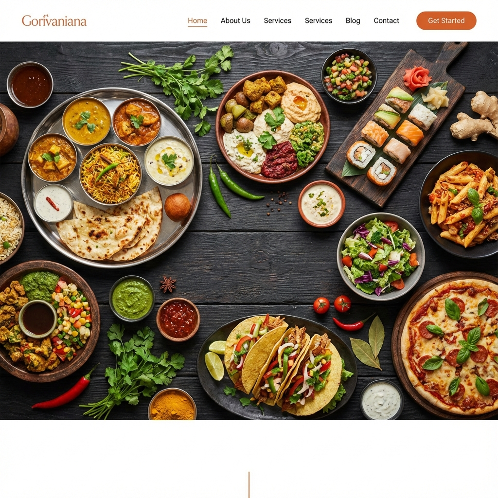
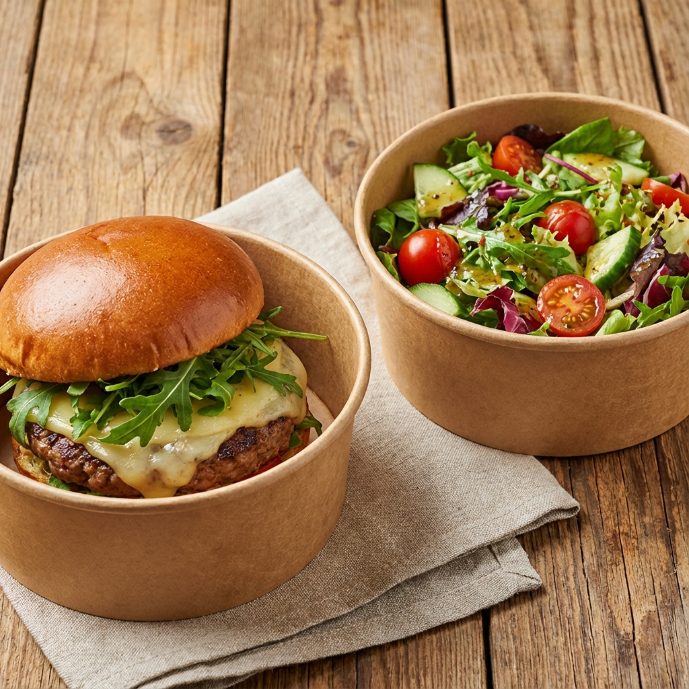
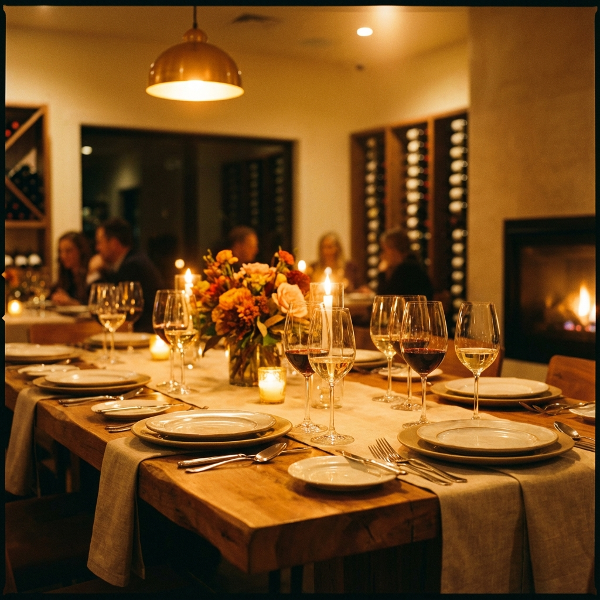
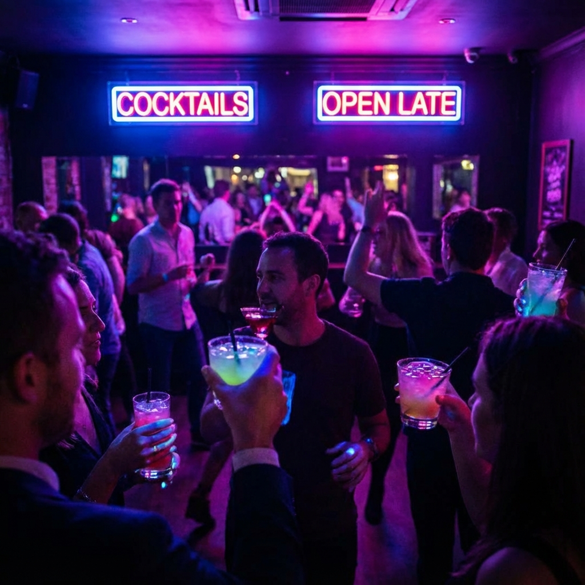

# 🍅 Zomato Clone



<div align="center">


</div>

## 📖 About The Project

A pixel-perfect, fully responsive clone of the **Zomato** website interaction and design. This project replicates the premium food delivery experience with a focus on visual aesthetics, smooth animations, and a user-friendly interface. It includes multiple pages for **Delivery**, **Dining Out**, and **Nightlife**, all tied together with a robust design system.

### 🌟 Live Demo
[**View Live Demo**](https://mitulaghara.github.io/Zomate-Clone/) 🚀

## ✨ Features

*   **🏠 Dynamic Home Page**:
    *   Immersive hero section with sticky navigation and search.
    *   Interactive category cards (Order Online, Dining Out, Nightlife).
    *   Curated collections with gradient overlays.
    *   Responsive locality grid.
*   **🛵 Delivery Page**:
    *   Sticky white header with compact search.
    *   Complex filter bar (Rating, Cuisines, Pure Veg).
    *   Detailed restaurant cards with discount tags and delivery estimates.
*   **🍽️ Dining Out Page**:
    *   Luxury-themed hero section with parallax-like visuals.
    *   Exclusive filters for "Gold" members and "Booking".
*   **🎉 Nightlife Page**:
    *   Dark-themed design logic for a party vibe.
    *   High-energy visuals and club listings.
*   **🔐 Authentication UI**:
    *   Beautiful, animated **Login/Signup Modals**.
    *   Seamless switching between auth modes.
    *   Form validation styling.
*   **📱 Fully Responsive**:
    *   Mobile-first approach.
    *   Adapts seamlessly from desktop to tablet and mobile screens.

## 📸 Screenshots

| Home Page | Delivery Page |
|:---:|:---:|
|  |  |

| Dining Out | Nightlife |
|:---:|:---:|
|  |  |

## 🛠️ Built With

*   **HTML5** - Semantic Structure
*   **CSS3** - Custom Properties (Variables), Flexbox, CSS Grid, Media Queries
*   **JavaScript (ES6)** - DOM Manipulation, Modal Logic, Dynamic Interactions
*   **Remix Icons** - Modern vector icons

## 🚀 Getting Started

1.  **Clone the repository**
    ```bash
    git clone https://github.com/mitulaghara/Zomate-Clone.git
    ```
2.  **Open the project**
    *   Navigate to the project folder.
    *   Open `index.html` in your browser (or use Live Server in VS Code).

## 📄 License

Distributed under the MIT License.

---
<p align="center">Made with ❤️ for Foodies</p>
